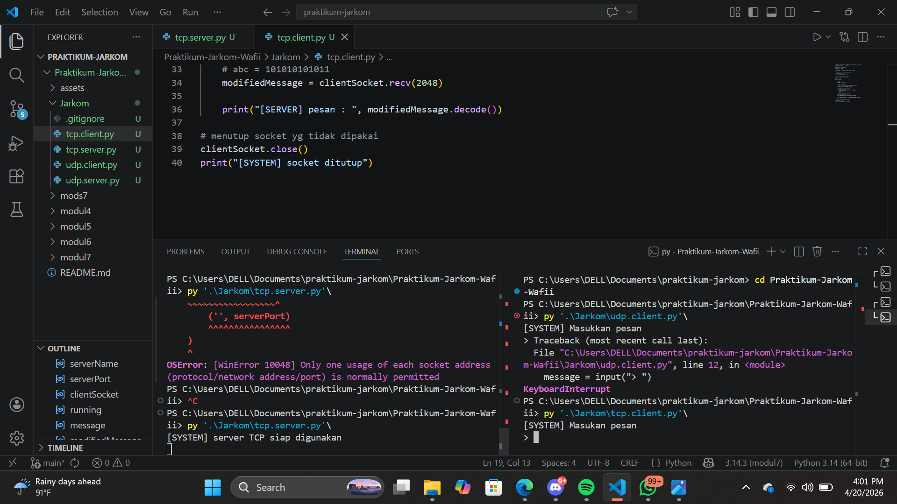
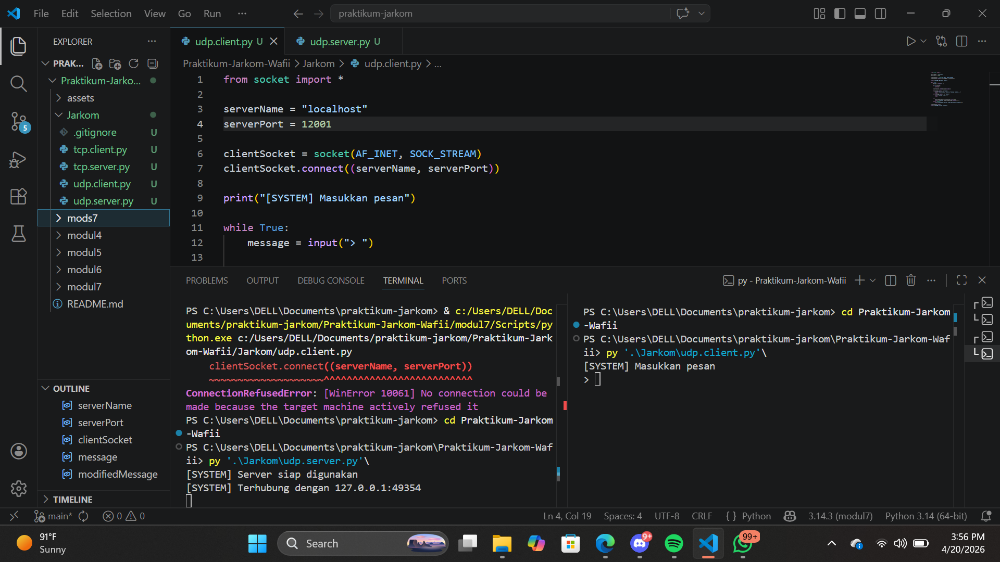

# Modul 7 Socket Programming

# TCP 
## TCP Client

from socket import *

serverName = "localhost"
serverPort = 12000

clientSocket = socket(AF_INET, SOCK_STREAM)

clientSocket.connect(
    (serverName, serverPort)
)

print("[SYSTEM] Masukan pesan")

running = True
while running:

    message = input("> ")

    clientSocket.send(message.encode())

    if message.lower() == "exit" :
        print("[SYSTEM] Keluar dari program")
        running = False
        break

    modifiedMessage = clientSocket.recv(2048)

    print("[SERVER] pesan: ", modifiedMessage.decode())

clientSocket.close()
print("[SYSTEM] socket ditutup")

## TCP Server

from socket import *

serverPort = 12000
serverSocket = socket(AF_INET, SOCK_STREAM)

serverSocket.bind(
    ('', serverPort)
)

serverSocket.listen(1)
print("[SYSTEM] server TCP siap digunakan")

running = True
while running: 
    
    connectionSocket, addr = serverSocket.accept()

    while True:
        message = connectionSocket.recv(2448).decode()

        if not message:
            break

        if message.lower() == "exit":
            print("[SYSTEM] client ingin keluar")
            running = False
            break

        modifiedMessage = message.upper()
        print("[SERVER] diterima: ",modifiedMessage)

        connectionSocket.send(
            modifiedMessage.encode()
        )
        
    connectionSocket.close()

serverSocket.close()

## Hasil yg didapatkan

1. Run server melalui terminal
2. Lalu run client melalui terminal juga
3. setelah client di run maka server menerima koneksi dari client
4. lalu client mengirim pesan dan pesan tersebut masuk ke server
5. server menampilkan hasil pesan dari client
6. jika client mengirim pesan "exit" maka koneksi server dan client otomatis terhenti

# UDP

## UDP CLient

from socket import *

serverName = "localhost"
serverPort = 12000

clientSocket = socket(AF_INET, SOCK_STREAM)
clientSocket.connect((serverName, serverPort))

print("[SYSTEM] Masukkan pesan")

while True:
    message = input("> ")

    if not message:
        continue

    clientSocket.send(message.encode())

    if message.lower() == "exit":
        print("Perintah exit dikirim. Menutup koneksi...")
        break
    elif message.lower() == "keluar":
        print("Menutup klien...")
        break

    try:
        modifiedMessage = clientSocket.recv(2048)
        print(f"[SERVER] {modifiedMessage.decode()}\n")
    except timeout:
        print("Kesalahan: Server tidak merespons (Timeout)\n")

clientSocket.close()
print("[SYSTEM] socket ditutup")

## UDP Server

from socket import *

serverPort = 12000
serverSocket = socket(AF_INET, SOCK_STREAM)

serverSocket.bind(('', serverPort))
serverSocket.listen(1)

print("[SYSTEM] Server siap digunakan")

running = True
while running:
    connectionSocket, clientAddress = serverSocket.accept()
    print(f"[SYSTEM] Terhubung dengan {clientAddress[0]}:{clientAddress[1]}")

    while True:
        message = connectionSocket.recv(2048)

        if not message:
            break

        original_message = message.decode().strip()

        if original_message.lower() == 'exit':
            print("[SYSTEM] Mematikan server...")
            running = False
            break

        modifiedMessage = original_message.upper()

        print(f"Diterima dari {clientAddress[0]}:{clientAddress[1]}: {original_message}")
        print(f"Mengirim balik: {modifiedMessage}")

        connectionSocket.send(modifiedMessage.encode())

    connectionSocket.close()

serverSocket.close()
print("[SYSTEM] Server ditutup")

## Hasil yg didapatkan

1. Run server
2. lalu run client nya
3. client mengirim pesan ke server
4. server akan mengirim pesan ke client dan di ubah menjadi huruf besar semua
5. jika ingin keluar maka ketik "exit"

## Prbedaan TCP & UDP

Perbedaan utama TCP dan UDP terletak pada cara pengiriman datanya.

TCP (Transmission Control Protocol) bersifat connection-oriented, artinya harus membangun koneksi terlebih dahulu sebelum mengirim data. TCP menjamin data sampai dengan lengkap, urut, dan tanpa duplikasi, tetapi kecepatannya lebih lambat karena ada proses pengecekan.

Sedangkan UDP (User Datagram Protocol) bersifat connectionless, sehingga data bisa langsung dikirim tanpa koneksi. UDP lebih cepat, tetapi tidak menjamin data sampai, tidak urut, dan bisa hilang.

Singkatnya, TCP digunakan ketika keamanan dan keakuratan data penting (seperti web dan email), sedangkan UDP digunakan ketika kecepatan lebih diutamakan (seperti game online dan streaming).