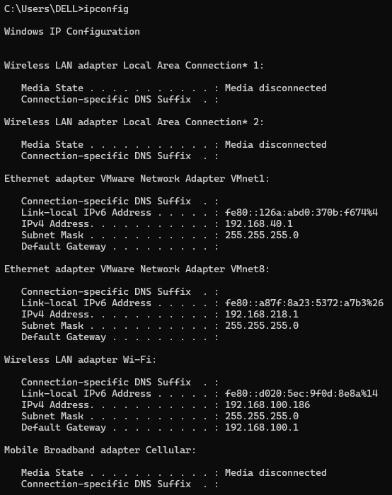
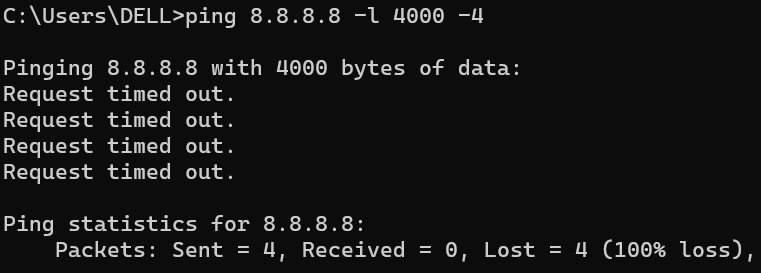
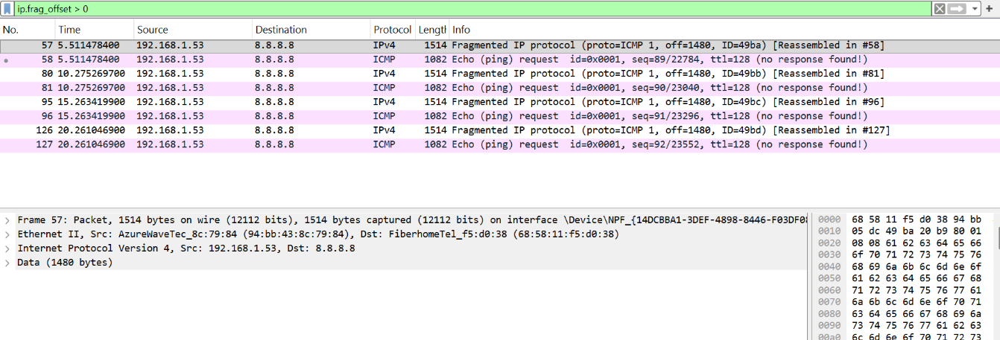
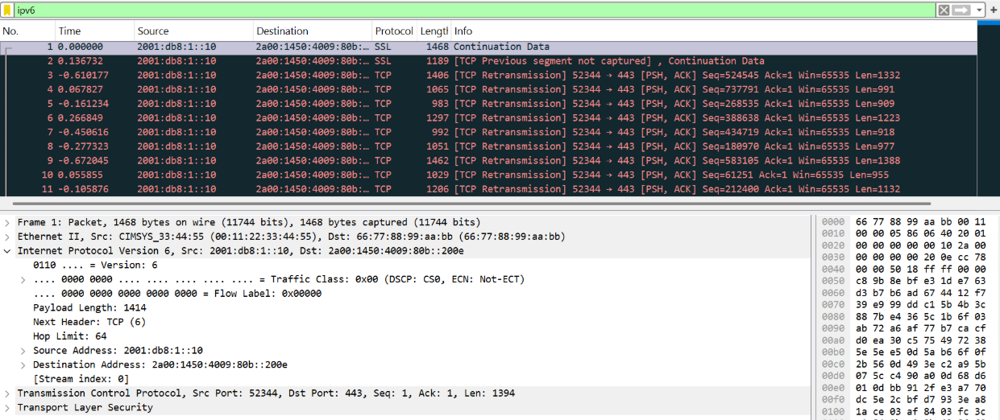

# Modul 10 IP

## Apa itu IP Address

IP Address (Internet Protocol Address) adalah deretan angka unik yang diberikan kepada setiap perangkat yang terhubung ke jaringan komputer, termasuk internet. Fungsinya mirip seperti alamat rumah, yaitu memastikan data dikirim dan diterima oleh perangkat yang tepat. IP Address terdiri dari dua versi utama: IPv4 (32-bit, contoh: 192.168.1.1) yang paling umum digunakan namun jumlahnya terbatas, serta IPv6 (128-bit, contoh: 2001:0db8:85a3::7334) yang dikembangkan untuk mengatasi keterbatasan IPv4 dengan kapasitas hampir tak terbatas.

Berdasarkan jangkauannya, IP Address dibedakan menjadi public IP (dapat diakses langsung dari internet, unik secara global, diberikan oleh ISP) dan private IP (hanya digunakan dalam jaringan lokal seperti rumah atau kantor, tidak bisa diakses langsung dari internet). Berdasarkan sifatnya, ada dynamic IP yang berubah-ubah dan diberikan otomatis oleh DHCP (umum untuk pengguna rumahan), serta static IP yang tetap dan dikonfigurasi manual (biasa digunakan untuk server). Rentang private IP yang umum adalah 10.0.0.0–10.255.255.255, 172.16.0.0–172.31.255.255, dan 192.168.0.0–192.168.255.255.

Ketika kita mengakses situs seperti Google, DNS akan mengubah nama domain menjadi IP Address, lalu komputer Anda mengirim permintaan ke IP tersebut, dan server membalas ke IP komputer Anda melalui router-router di internet. IP Address memiliki tiga fungsi utama: identifikasi (membedakan perangkat), lokasi (menunjukkan posisi perangkat dalam jaringan), dan routing (mengarahkan paket data ke tujuan yang benar). Untuk melihat IP Address sendiri, pengguna Windows bisa mengetik ipconfig di Command Prompt, pengguna Linux/Mac mengetik ifconfig di Terminal.

Tampilannya akan muncul seperti gambar dibawah ini

## Traceroute Dari Suatu Website

Perintah tracert (Trace Route) digunakan untuk melacak jalur yang dilalui paket data dari komputer pengguna (dalam hal ini dari alamat IP 192.168.100.1) menuju server tujuan youtube.com dengan alamat IP akhir 142.251.12.190. Hasil di atas menunjukkan bahwa paket melewati 12 hop (lompatan) pertama yang berhasil, kemudian mengalami request timed out pada hop 13 hingga 21, dan akhirnya berhasil mencapai tujuan pada hop ke-22. Hop 1 adalah router lokal (192.168.100.1), hop 2 adalah gateway dari ISP (10.114.0.1), dan hop 3 hingga 12 adalah router milik ISP dan jaringan Google (ditandai dengan awalan 180.xxx, 74.125.xxx, 142.251.xxx, 172.253.xxx) yang merupakan jalur backbone menuju server YouTube.

## Analisis

Dari kolom waktu (dalam milidetik/ms), terlihat bahwa hop awal memiliki latency sangat rendah (1-6 ms), menunjukkan koneksi lokal yang cepat. Latency mulai meningkat pada hop 3 (19-22 ms) dan hop 4 (32 ms, dengan satu paket hilang/*), yang mengindikasikan adanya kemacetan atau antrean data saat melewati router ISP di level agregasi. Pada hop 5 hingga 12, latency stabil di kisaran 23-37 ms, yang masih sangat baik untuk koneksi internet. Yang menarik, hop 7 hingga 12 menggunakan IP milik Google (74.125.xxx, 142.251.xxx, 172.253.xxx), menandakan bahwa sejak hop 7, paket sudah masuk ke dalam jaringan backbone Google, yang umumnya dioptimalkan untuk latency rendah dan throughput tinggi. Tidak ada lonjakan latency yang drastis, sehingga koneksi secara umum stabil.

Pada hop 13 hingga 21 terjadi "Request timed out" (semua paket hilang). Ini bukan berarti koneksi putus, melainkan router pada hop tersebut dikonfigurasi untuk tidak merespons permintaan ICMP (protokol yang digunakan tracert) demi alasan keamanan atau manajemen lalu lintas. Hal ini sangat umum terjadi di jaringan besar milik Google. Buktinya, pada hop ke-22 paket tetap berhasil mencapai server tujuan (se-in-f190.1e100.net yang merupakan server YouTube) dengan latency 24-31 ms. Kesimpulannya, rute menuju YouTube berfungsi normal, tidak ada kerusakan jaringan, dan total waktu tempuh dari komputer pengguna ke server YouTube sekitar 24-31 ms, yang termasuk sangat baik untuk akses internet rumahan atau kantor. Satu-satunya catatan adalah paket yang hilang pada hop 4 (satu bintang/*) menunjukkan fluktuasi kecil, namun tidak berdampak signifikan karena hop berikutnya tetap berhasil.

## Apa Itu ICMP, MTU, TTL

## ICMP (Internet Control Message Protocol)

ICMP adalah protokol yang digunakan oleh perangkat jaringan seperti router dan komputer untuk mengirim pesan kesalahan serta informasi diagnostik, bukan untuk mengangkut data pengguna seperti halnya TCP atau UDP. Fungsi utamanya adalah melaporkan masalah koneksi, seperti host tidak terjangkau, waktu habis (time exceeded), atau redirection. Contoh paling sederhana adalah perintah ping: ketika Kita mengetik ping 8.8.8.8, komputer Anda mengirimkan paket ICMP Echo Request ke server Google, dan jika server merespons maka akan membalas dengan ICMP Echo Reply. Pada hasil tracert youtube.com di file Kita, pesan "Request timed out" pada hop 13-21 terjadi karena router di jalur tersebut tidak membalas pesan ICMP (biasanya diblokir firewall), namun ini bukan berarti koneksi terputus karena pada hop 22 paket tetap berhasil sampai tujuan.

## MTU (Maximum Transmission Unit)

MTU adalah ukuran maksimum (dalam satuan byte) dari sebuah paket data yang dapat dikirim melalui suatu antarmuka jaringan dalam satu kali pengiriman tanpa perlu dipecah menjadi potongan-potongan kecil (fragmentation). Jika paket yang dikirim lebih besar dari MTU, maka paket tersebut akan dipecah oleh router (yang memperlambat pengiriman) atau ditolak sama sekali. Nilai MTU standar untuk jaringan Ethernet adalah 1500 byte, sedangkan untuk koneksi PPPoE (umum pada internet rumahan) biasanya 1492 byte. Contoh pengujiannya: di Windows Anda bisa menjalankan ping -f -l 1472 8.8.8.8 — nilai 1472 dipilih karena 1472 (data) + 20 (header IP) + 8 (header ICMP) = 1500 byte, tepat sama dengan MTU Ethernet. Jika perintah ini berhasil, berarti MTU jalur Anda 1500; jika gagal (perlu fragmentasi), maka MTU Anda lebih kecil, misalnya karena menggunakan VPN atau koneksi PPPoE.

## TTL (Time To Live)

TTL adalah nilai dalam header paket IP yang berfungsi sebagai penghitung batas maksimal berapa banyak hop (lompatan antar router) yang boleh dilalui oleh sebuah paket sebelum akhirnya dibuang. Setiap kali paket melewati satu router, nilai TTL akan dikurangi 1; ketika TTL mencapai 0, router akan membuang paket tersebut dan mengirimkan pesan ICMP Time Exceeded kembali ke pengirim. TTL berguna untuk mencegah paket berjalan tanpa henti di internet akibat adanya routing loop. Contoh penerapan TTL dapat dilihat pada perintah tracert youtube.com di file Anda: tracert bekerja dengan mengirim paket pertama dengan TTL=1, sehingga router pertama (192.168.100.1) mengurangi TTL menjadi 0 lalu membuang paket dan membalas, sehingga hop pertama terdeteksi; kemudian tracert mengirim paket dengan TTL=2 agar router pertama meneruskan dan router kedua yang membuang, dan seterusnya hingga hop ke-12. Nilai TTL awal berbeda-beda tiap sistem operasi: Windows umumnya 128, Linux/macOS 64.

## Contoh Fragmentasi Pada Wireshark

## Langkah-langkah :

1. Buka aplikasi wireshark dan mulai capture pada interface aktif

2. Mengirim paket berukuran besar melalui Command Prompt dengan perintah seperti ini : ping 8.8.8.8 -l 4000 -4

3. Hentikan capture pada Wireshark

4. Masukkan filter : ip.frag_offset > 0

5. Mengamati paket yang muncul

Berdasarkan hasil pengamatan pada Wireshark, setelah dilakukan filter ip.frag_offset > 0, ditemukan beberapa paket yang mengalami fragmentasi. Terlihat paket dengan keterangan “Fragmented IP protocol” serta nilai fragment offset sebesar 1480, yang menunjukkan bahwa paket telah dipecah menjadi beberapa bagian. Selain itu, terdapat informasi “Reassembled” yang menunjukkan bahwa paket-paket tersebut dapat digabung kembali.

Fragmentasi terjadi karena ukuran paket yang dikirim (4000 byte) melebihi nilai MTU jaringan (sekitar 1500 byte). Oleh karena itu, paket harus dipecah menjadi beberapa bagian agar dapat dikirim melalui jaringan. Setiap fragment memiliki nilai fragment offset yang menunjukkan posisi potongan data dalam paket asli. Selain itu, flag “More Fragments” menunjukkan bahwa masih terdapat bagian lain dari paket tersebut.

Walaupun pada hasil ping di Command Prompt terjadi Request timed out, paket tetap terkirim dan dapat dianalisis di Wireshark. Fragmentasi terjadi ketika ukuran paket melebihi batas MTU. Pada percobaan ini, fragmentasi berhasil diamati di Wireshark melalui adanya fragment offset dan informasi paket terfragmentasi.

## IPV6 Pada Wireshark

## Langkah - Langkah :

1. Membuka file "ipv6_sample.pcap" pada wireshark
2. Masukkan filter : ipv6
3. Memilih salah satu paket yang muncul
4. Mengamati bagian Internet Protocol Version 6 (IPv6)

Setelah dilakukan filter ipv6, ditemukan beberapa paket yang menggunakan protokol IPv6.

Pada paket yang diamati, terlihat informasi sebagai berikut:

Source Address: 2001:db8:1::10
Destination Address: 2a00:1450:4009:80b::200e
Alamat tersebut menunjukkan bahwa paket menggunakan format IPv6 yang terdiri dari kombinasi angka dan huruf yang dipisahkan oleh tanda titik dua (:). IPv6 merupakan versi terbaru dari Internet Protocol yang menggunakan panjang alamat 128-bit. Berbeda dengan IPv4, IPv6 memiliki format alamat yang lebih panjang dan kompleks.

Pada hasil pengamatan di Wireshark, terlihat bahwa paket menggunakan Internet Protocol Version 6, yang dapat dikenali dari label tersebut serta adanya alamat source dan destination dengan format IPv6. Penggunaan IPv6 bertujuan untuk mengatasi keterbatasan jumlah alamat pada IPv4 serta meningkatkan efisiensi dalam pengalamatan jaringan.