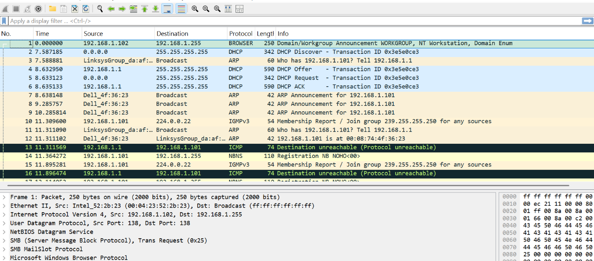
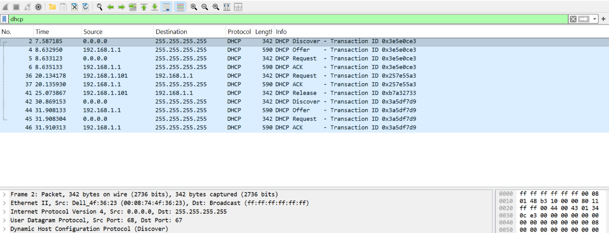

# Modul 11 DHCP

## Apa itu DHCP

DHCP (Dynamic Host Configuration Protocol) adalah protokol jaringan yang bertugas memberikan alamat IP dan konfigurasi jaringan lainnya secara otomatis kepada perangkat (komputer, HP, printer) yang terhubung ke suatu jaringan. Analoginya seperti petugas hotel yang memberikan kunci kamar unik kepada setiap tamu yang datang; tanpa DHCP, setiap perangkat harus disetel alamat IP-nya secara manual. Protokol ini juga sekaligus memberikan informasi penting lain seperti subnet mask, gateway default (akses ke router/internet), dan alamat DNS.

Manfaat utama DHCP adalah kemudahan dan efisiensi, karena Anda tidak perlu repot mengonfigurasi satu per satu perangkat dan terhindar dari risiko konflik alamat IP (dua perangkat memakai IP sama). DHCP sangat penting pada jaringan dengan banyak perangkat seperti wifi rumah, kantor, atau hotspot ponsel—di mana router atau server akan secara otomatis "meminjamkan" alamat IP sementara dan mengelolanya kembali saat perangkat putus. Dengan kata lain, DHCP adalah "pemberi alamat otomatis" yang membuat koneksi internet menjadi lebih praktis tanpa setting manual.

## Kelebihan & Kekurangan DHCP

### Kelebihan :

1. Kemudahan dan Otomatisasi: Kelebihan utama. Administrator atau pengguna tidak perlu memasukkan alamat IP, subnet mask, gateway, dan DNS secara manual di setiap perangkat. Cukup aktifkan DHCP, maka perangkat akan mendapat konfigurasi otomatis saat terhubung ke jaringan.

2. Mencegah Konflik IP: DHCP memastikan tidak ada dua perangkat yang mendapatkan alamat IP yang sama dalam satu jaringan. Konflik IP bisa menyebabkan koneksi kedua perangkat bermasalah atau mati total.

3. Efisien untuk Jaringan Besar & Dinamis: Sangat cocok untuk lingkungan dengan banyak perangkat (kantor, kampus, wifi umum) atau perangkat yang sering masuk-keluar jaringan (laptop, ponsel). Administrator tidak perlu repot mendata dan mengisi IP satu per satu.

4. Pemanfaatan IP Lebih Hemat: DHCP biasanya memberikan IP secara leasing (pinjam) untuk jangka waktu tertentu. Saat perangkat dimatikan atau pindah jaringan, IP tersebut bisa "disewakan" ke perangkat lain, sehingga jumlah IP yang tersedia tidak cepat habis.

5. Pusat Konfigurasi (Centralized): Perubahan konfigurasi jaringan (misalnya mengganti alamat DNS atau gateway) cukup dilakukan sekali di server DHCP, dan semua perangkat klien akan mendapatkan pembaruan secara otomatis setelah masa sewa habis atau restart.

### Kekurangan :

1. Tidak Cocok untuk Perangkat Server: Perangkat yang harus selalu bisa diakses dengan alamat IP tetap (seperti server web, server printer, atau server kamera CCTV) tidak cocok menggunakan DHCP. Jika IP-nya berubah otomatis, klien lain tidak akan bisa menemukan server tersebut.

Solusi: Gunakan DHCP Reservation (mengunci IP tertentu untuk MAC address perangkat tertentu) atau gunakan IP statis.

2. Masalah Koneksi Sementara (Leasing Time): Karena IP bersifat pinjaman (lease), ada kemungkinan perangkat kehilangan koneksi atau gagal memperpanjang sewa (misalnya server DHCP down atau jaringan gangguan). Jika masa sewa habis dan tidak bisa renew, perangkat akan kehilangan IP dan tidak bisa terhubung ke jaringan.

3. Ketergantungan pada Server DHCP: Jika hanya ada satu server DHCP dan server tersebut mati atau bermasalah, tidak ada perangkat baru yang bisa mendapatkan IP. Perangkat yang sudah punya IP mungkin masih bisa bertahan sampai masa sewanya habis, tapi setelah itu ikut bermasalah.

Solusi: Gunakan redundansi (DHCP failover/cluster) di jaringan kritis.

4. Risiko Keamanan:

Rogue DHCP Server: Siapa pun bisa menyalakan server DHCP nakal di jaringan yang sama. Jika perangkat mendapat IP dari server nakal, lalu lintas internet bisa disadap (Man-in-the-Middle) atau koneksi diarahkan ke situs palsu.

Tidak Ada Otentikasi: Klien DHCP tidak memverifikasi apakah server DHCP itu resmi atau tidak (tanpa fitur tambahan seperti DHCP Snooping).

5. Traceability Kurang Langsung: Karena IP berubah-ubah, melacak perangkat tertentu berdasarkan alamat IP saja lebih sulit dibandingkan dengan IP statis (untuk keperluan audit atau investigasi jaringan). Biasanya butuh catatan log dari server DHCP.

## DORA

DORA merupakan singkatan dari Discover, Offer, Request, dan Acknowledgment, yaitu empat tahapan utama yang terjadi ketika sebuah perangkat (client) meminta alamat IP secara otomatis dari DHCP Server.

### Langkah - langkah :

1. Membuka file dhcp-ethereal-trace-1 pada wireshark.

2. Gunakan filter "dhcp" untuk menampilkan paket dhcp.

Pada gambar tersebut terdapat 4 paket utama yang menunjukkan proses DORA, yaitu:

1. Discover
Paket ini dikirim oleh client dengan alamat sumber 0.0.0.0 ke alamat broadcast 255.255.255.255. Pada tahap ini, client belum memiliki alamat IP sehingga mengirimkan pesan untuk mencari DHCP Server yang tersedia di jaringan.

2. Offer
Setelah menerima pesan Discover, DHCP Server dengan alamat IP 192.168.1.1 merespons dengan mengirimkan pesan Offer. Paket ini berisi tawaran alamat IP yang dapat digunakan oleh client beserta informasi jaringan lainnya, seperti subnet mask, default gateway, dan DNS server.

3. Request
Client kemudian mengirimkan pesan Request ke alamat broadcast untuk menyatakan bahwa client menerima tawaran alamat IP yang diberikan oleh DHCP Server dan meminta agar alamat tersebut secara resmi dialokasikan.

4. ACK (Acknowledgment)
DHCP Server mengirimkan pesan ACK sebagai konfirmasi bahwa permintaan client telah disetujui. Pada tahap ini, alamat IP beserta konfigurasi jaringan lainnya diberikan kepada client, sehingga perangkat dapat mulai terhubung ke jaringan.

Berdasarkan hasil pengamatan pada Wireshark, proses DORA berlangsung secara berurutan dan berhasil. DHCP Server yang digunakan memiliki alamat IP 192.168.1.1, sedangkan client pada awal proses belum memiliki alamat IP sehingga menggunakan alamat 0.0.0.0. Setelah tahap ACK selesai, client memperoleh konfigurasi jaringan secara otomatis dan dapat menggunakan jaringan dengan normal.