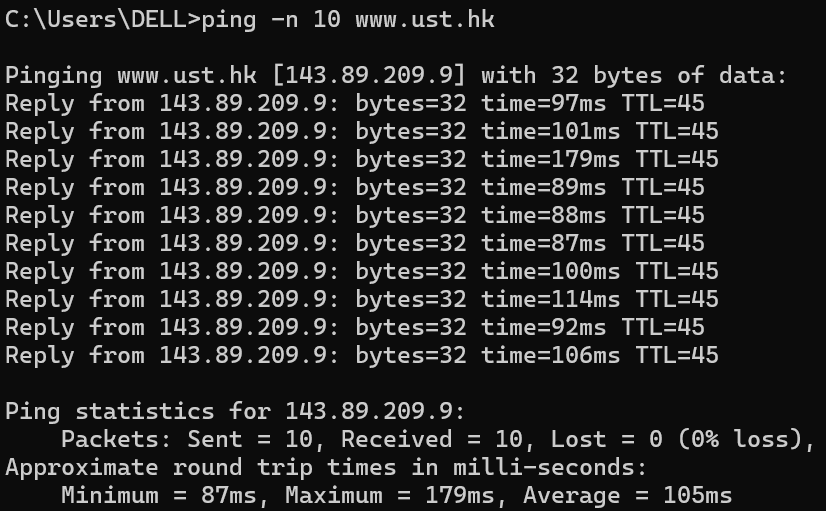
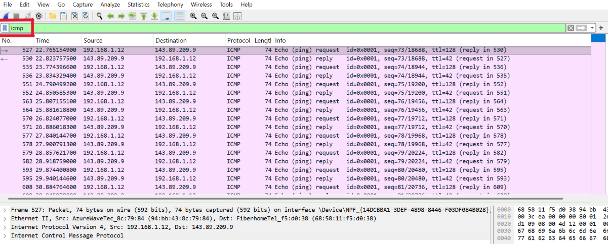
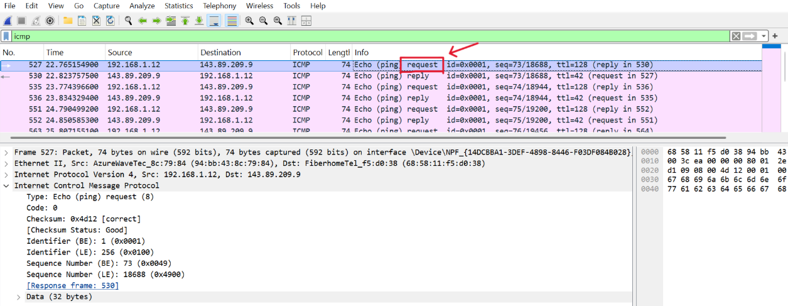
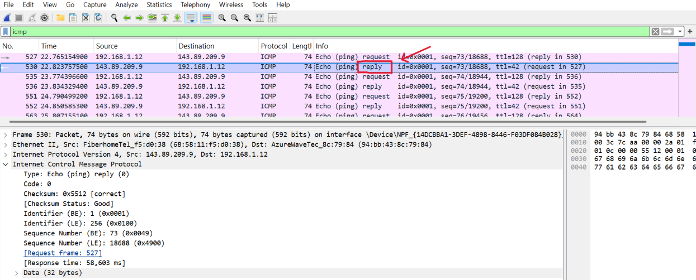
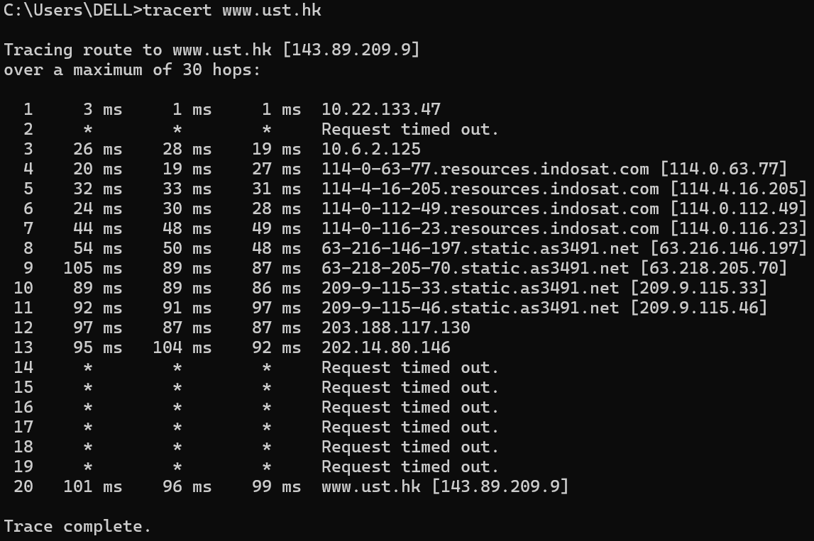
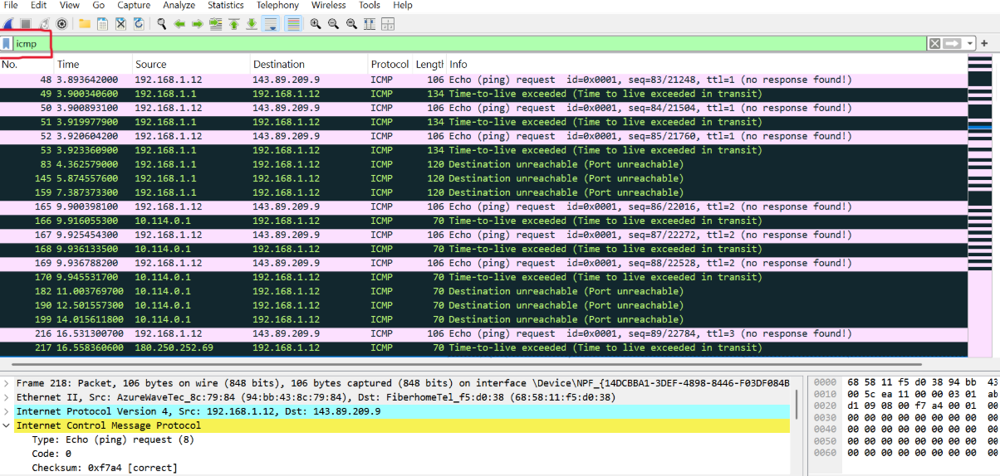
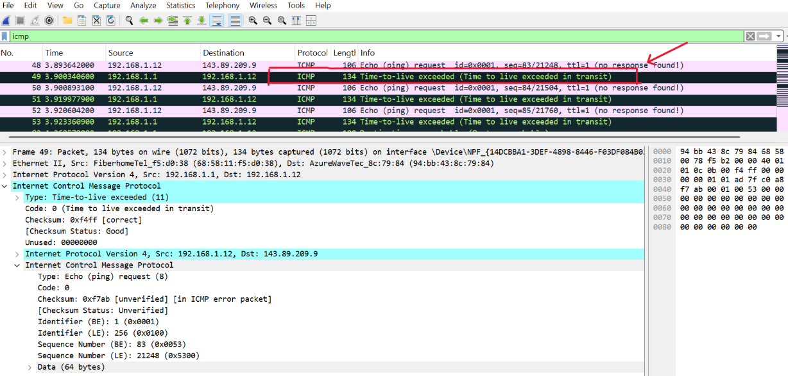

# Modul 12 ICMP

## ICMP

Internet Control Message Protocol (ICMP) merupakan protokol yang digunakan pada jaringan komputer untuk membantu proses diagnosis dan pengendalian jaringan. ICMP bekerja bersama protokol IP dan digunakan untuk memberikan informasi mengenai kondisi komunikasi data di dalam jaringan.

ICMP memiliki hubungan yang erat dengan protokol IP. Paket IP digunakan untuk mengirim data, sedangkan ICMP berada di dalam payload paket IP. Jadi seperti, ICMP dikirim sebagai isi data dari paket IP.

Format dan isi paket ICMP
1. Type = ini menunjukkan jenis pesan ICMP yang dikirim. Contohnya:
- Type 8 = Echo Request
- Type 0 = Echo Reply
- Type 11 = TTL Exceeded atau Time Exceeded
2. Code = digunakan untuk memberikan detail tambahan mengenai type ICMP tertentu.
3. Checksum = digunakan untuk mengecek apakah terjadi kerusakan atau error pada paket selama proses transmisi data.
4. Identifier = berfungsi sebagai penanda paket agar paket request dan reply dapat dikenali sebagai pasangan komunikasi yang sesuai.
5. Sequence Number = digunakan untuk menunjukkan urutan paket ICMP yang dikirim sehingga mempermudah proses pelacakan paket selama komunikasi berlangsung.

# Analisis ICMP yang Dihasilkan Oleh Ping

## Langkah - langkah :

1. Membuka aplikasi Wireshark

2. Membuka CMD, kemudian masukkan perintah "ping -n 10 www.ust.hk"

3. Stop capture pada Wireshark

4. Melakukan filter paket ICMP 

Program ping menghasilkan dua jenis pesan ICMP, yaitu ICMP Echo Request dan ICMP Echo Reply. Pada percobaan ini digunakan perintah -n 10 pada CMD yang berarti proses ping dilakukan sebanyak 10 kali. Setiap proses ping akan menghasilkan satu paket Echo Request dan satu paket Echo Reply sebagai balasannya. Oleh karena itu, total paket ICMP yang tertangkap pada Wireshark berjumlah 20 paket, terdiri dari 10 paket request dan 10 paket reply.

# Paket ICMP Echo Request

Berdasarkan hasil capture pada Wireshark, terlihat paket ICMP dengan tipe Echo (ping) request yang dikirim dari alamat IP 192.168.1.12 menuju 143.89.209.9.

Pada bagian Internet Control Message Protocol terdapat beberapa informasi penting, yaitu:

1. Type : Echo (ping) request (8)
2. Code : 0
3. Checksum : 0x4d12 [correct]
4. Identifier (BE) : 1 (0x0001)
5. Sequence Number (BE) : 73 (0x0049)

Berdasarkan hasil pengamatan tersebut, dapat disimpulkan bahwa komputer berhasil mengirim paket ICMP Echo Request ke host tujuan sebagai proses pengecekan konektivitas jaringan.

# Paket ICMP Echo Reply

Berdasarkan hasil capture pada Wireshark, terlihat paket ICMP dengan tipe Echo (ping) reply yang dikirim dari alamat IP 143.89.209.9 menuju 192.168.1.12. Paket ini merupakan balasan dari host tujuan terhadap ICMP Echo Request yang sebelumnya dikirim oleh komputer pengirim.

Pada bagian Internet Control Message Protocol terdapat beberapa informasi penting, yaitu:

1. Type : Echo (ping) reply (0)
2. Code : 0
3. Checksum : 0x5512 [correct]
4. Identifier (BE) : 1 (0x0001)
5. Sequence Number (BE) : 73 (0x0049)

Berdasarkan hasil pengamatan tersebut dapat disimpulkan bahwa host tujuan berhasil menerima paket Echo Request dan mengirimkan Echo Reply sebagai tanda bahwa koneksi jaringan berjalan dengan baik.

# Analisis ICMP yang Dihasilkan Oleh Traceroute

## Langkah - langkah :
1. Membuka aplikasi Wireshark

2. Membuka CMD, kemudian masukkan perintah "tracert www.ust.hk"

3. Menunggu proses Traceroute

4. Stop capture pada Wireshark

5. Melakukan filter paket ICMP

Setelah dilakukan filter icmp pada Wireshark, terlihat berbagai paket ICMP yang muncul selama proses traceroute berlangsung. Paket-paket tersebut terdiri dari Echo Request, Time-to-live exceeded, dan Destination unreachable. Paket Echo Request merupakan paket yang dikirim oleh komputer pengirim menuju host tujuan, sedangkan paket Time-to-live exceeded muncul dari router yang dilewati ketika nilai TTL pada paket habis di tengah perjalanan jaringan. Pada hasil capture terlihat beberapa paket berwarna hitam yang menunjukkan adanya pesan ICMP error. Paket inilah yang digunakan oleh traceroute untuk mengetahui hop atau jalur yang dilalui paket sebelum mencapai tujuan. Setelah itu dilakukan analisis lebih lanjut pada salah satu paket ICMP dengan pesan “Time-to-live exceeded (Time to live exceeded in transit)”.

6. Memilih Paket ICMP Time Exceeded

# Paket ICMP Time Exceeded pada Traceroute

Berdasarkan hasil capture Wireshark setelah menjalankan perintah tracert www.ust.hk, terlihat paket ICMP dengan tipe : Time-to-live exceeded (11). Paket tersebut dikirim dari alamat IP 192.168.1.1 menuju 192.168.1.12. Pesan ini muncul karena nilai TTL (Time To Live) pada paket telah habis saat berada di router.

Pada bagian Internet Control Message Protocol terdapat beberapa informasi penting, yaitu:

1. Type : Time-to-live exceeded (11)
2. Code : 0 (Time to live exceeded in transit)
3. Checksum : 0xf4ff [correct]

Selain itu, pada bagian bawah paket juga terlihat informasi paket asli yang menyebabkan error, yaitu paket : Echo (ping) request (8).

Paket tersebut sebelumnya dikirim dari :
- Source : 192.168.1.12
- Destination : 143.89.209.9

dengan nilai :

- Sequence Number = 83
- Identifier = 1

Hal ini menunjukkan bahwa paket Echo Request yang dikirim oleh komputer pengirim tidak berhasil mencapai tujuan karena nilai TTL habis di router 192.168.1.1. Router kemudian mengirimkan pesan ICMP Time Exceeded kembali ke pengirim.

Berdasarkan hasil pengamatan tersebut dapat disimpulkan bahwa program traceroute bekerja dengan memanfaatkan pesan ICMP Time Exceeded untuk mengetahui hop atau jalur yang dilewati paket dalam jaringan komputer.