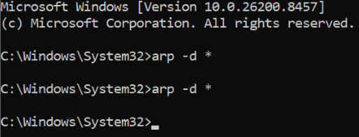
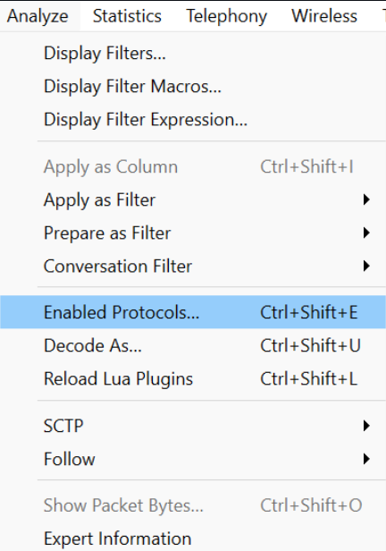
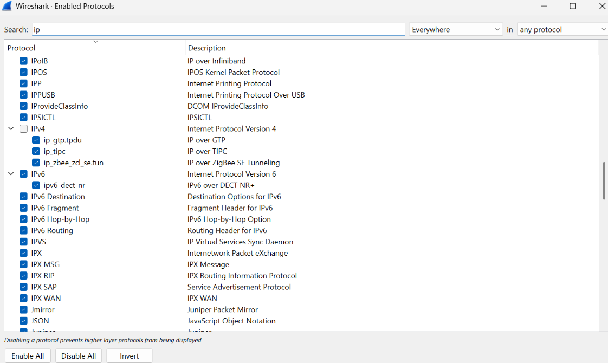
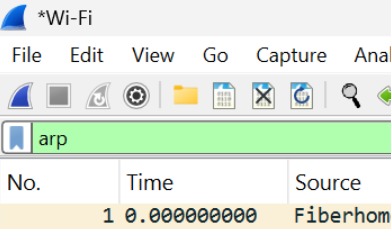
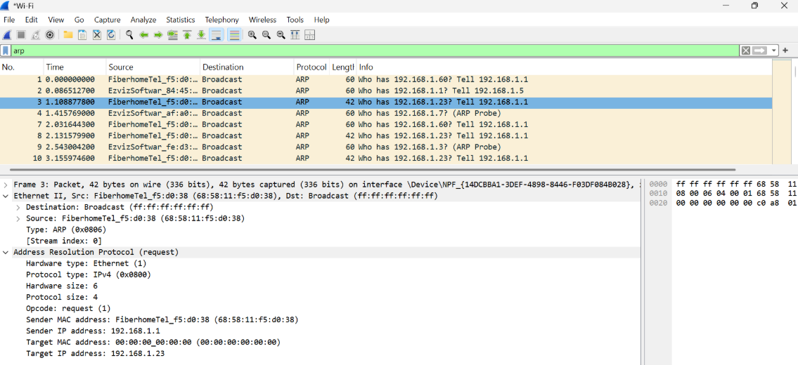

# MODUL 13 ETHERNET AND ARP

Ethernet dan Address Resolution Protocol (ARP) merupakan dua komponen penting dalam komunikasi jaringan komputer, khususnya pada Local Area Network (LAN). Ethernet adalah teknologi jaringan yang bekerja pada Layer 2 (Data Link Layer) model OSI dan berfungsi untuk mengatur pengiriman data antar perangkat menggunakan MAC Address sebagai identitas fisik perangkat. Data pada Ethernet dikirim dalam bentuk frame yang berisi informasi seperti alamat MAC sumber, alamat MAC tujuan, jenis protokol (EtherType), dan data yang dikirimkan.

Dalam proses komunikasi jaringan, perangkat biasanya mengenali tujuan berdasarkan alamat IP, sedangkan Ethernet memerlukan MAC Address untuk mengirimkan frame. Oleh karena itu, digunakan Address Resolution Protocol (ARP) yang berfungsi untuk menerjemahkan atau memetakan alamat IP menjadi MAC Address yang sesuai. ARP bekerja di antara Layer 2 (Data Link Layer) dan Layer 3 (Network Layer) sehingga memungkinkan perangkat menemukan alamat fisik dari perangkat tujuan dalam jaringan lokal.

## Cara Kerja Ethernet dan ARP

1. Perangkat ingin mengirim data ke alamat IP tujuan dalam jaringan lokal.
2. Perangkat memeriksa ARP Cache untuk mengetahui apakah MAC Address tujuan sudah tersimpan.
3. Jika belum tersedia, perangkat mengirimkan ARP Request secara broadcast untuk mencari MAC Address yang sesuai dengan alamat IP tujuan.
4. Perangkat yang memiliki alamat IP tersebut mengirimkan ARP Reply yang berisi MAC Address miliknya.
5. Pengirim menyimpan informasi IP dan MAC Address tersebut ke dalam ARP Cache.
6. Setelah MAC Address tujuan diketahui, data dikirim melalui jaringan menggunakan frame Ethernet.
7. Perangkat tujuan menerima frame Ethernet dan memproses data yang dikirimkan.

## Analisis ARP pada Wireshark

1. Menghapus ARP Cache

Pada tahap pertama, dilakukan penghapusan seluruh isi ARP Cache menggunakan perintah arp -d * pada Command Prompt yang dijalankan sebagai Administrator. Tujuan dari langkah ini adalah menghapus data pemetaan alamat IP dan MAC Address yang tersimpan sebelumnya sehingga komputer harus melakukan proses ARP kembali ketika akan berkomunikasi dengan perangkat lain. Dengan demikian, paket ARP yang muncul dapat diamati melalui Wireshark.

2. Mengaktifkan Protokol IPv4 pada Wireshark

Selanjutnya, aplikasi Wireshark dibuka dan dilakukan pengecekan pada menu Analyze → Enabled Protocols → IPv4. Langkah ini bertujuan memastikan bahwa protokol IPv4 aktif sehingga paket yang berkaitan dengan proses ARP dan komunikasi jaringan dapat ditangkap serta dianalisis dengan baik.

3. Setelah konfigurasi selesai, proses capture paket dimulai pada antarmuka jaringan yang digunakan. Wireshark mulai merekam seluruh lalu lintas data yang melewati perangkat selama praktikum berlangsung.

4. Mengakses Website Tujuan

Saat proses capture berjalan, browser digunakan untuk mengakses halaman web "http://gaia.cs.umass.edu/wireshark-labs/HTTP-ethereal-lab-file3.html". Aktivitas ini memicu terjadinya komunikasi jaringan yang menghasilkan paket Ethernet dan ARP yang kemudian direkam oleh Wireshark.

5. Menghentikan Capture
Setelah halaman web berhasil diakses, proses capture dihentikan. Seluruh paket yang berhasil direkam selama komunikasi jaringan berlangsung kemudian siap untuk dianalisis.

6. Menampilkan Paket ARP
Untuk mempermudah analisis, digunakan filter arp pada Wireshark sehingga hanya paket-paket ARP yang ditampilkan. Dari hasil penyaringan tersebut dapat diamati proses pertukaran ARP Request yang terjadi ketika perangkat mencari alamat MAC dari suatu alamat IP dalam jaringan lokal.

7. Analisis Paket ARP

Setelah filter arp diterapkan pada Wireshark, diperoleh beberapa paket ARP yang terekam selama proses komunikasi jaringan. Salah satu paket yang diamati merupakan ARP Request dengan informasi "Who has 192.168.1.23? Tell 192.168.1.1". Hal ini menunjukkan bahwa perangkat dengan alamat IP 192.168.1.1 sedang mencari alamat MAC dari perangkat yang memiliki alamat IP 192.168.1.23.

Berdasarkan detail paket, ARP Request dikirim menggunakan metode broadcast dengan alamat tujuan ff:ff:ff:ff:ff:ff, sehingga seluruh perangkat dalam jaringan lokal menerima permintaan tersebut. Selain itu, diketahui bahwa Sender IP Address adalah 192.168.1.1 dengan Sender MAC Address 68:58:11:f5:d0:38. Sementara itu, Target MAC Address masih bernilai 00:00:00:00:00:00 karena alamat MAC tujuan belum diketahui oleh pengirim.

Hasil pengamatan ini menunjukkan bahwa ARP berfungsi untuk mencari dan memperoleh alamat MAC dari suatu perangkat berdasarkan alamat IP yang dituju sebelum proses pengiriman data dilakukan melalui jaringan Ethernet.