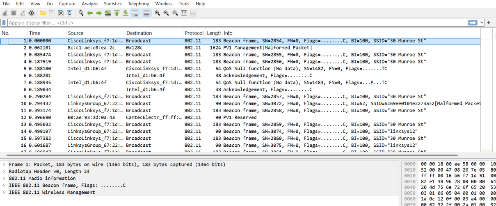
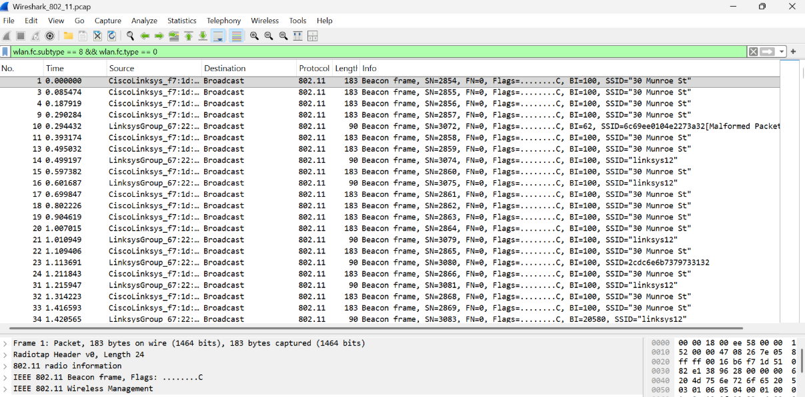
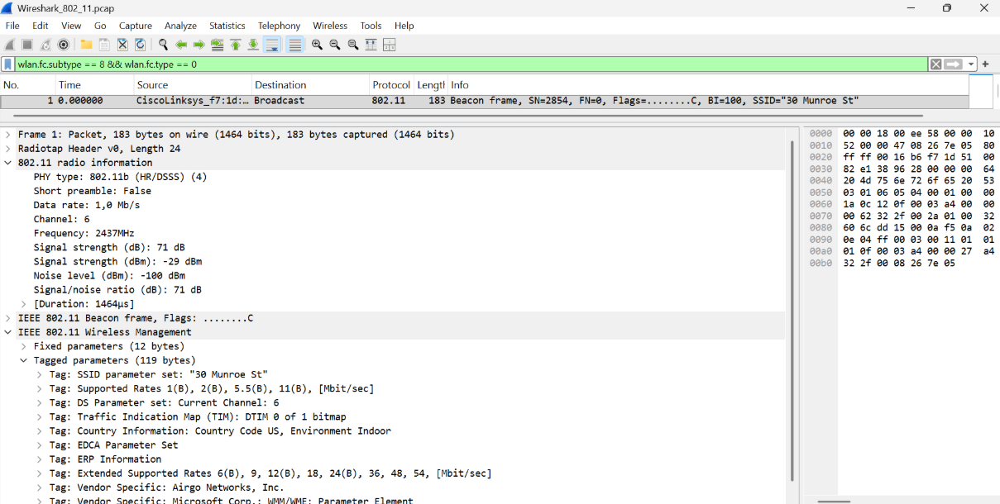
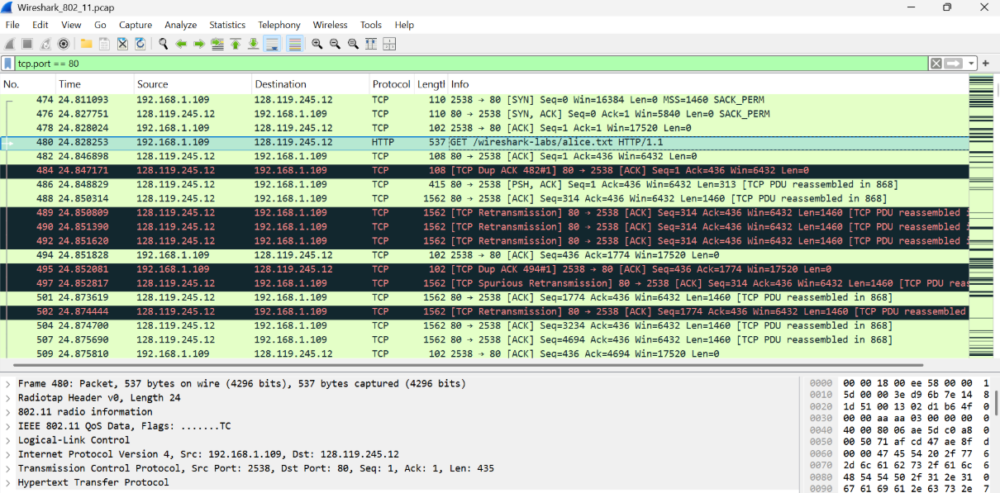
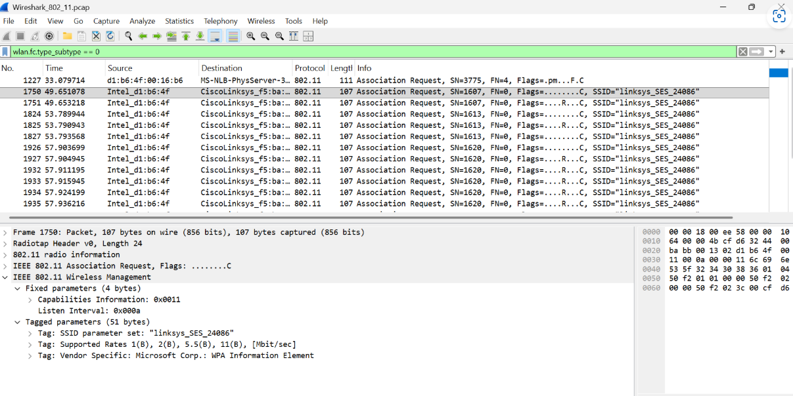
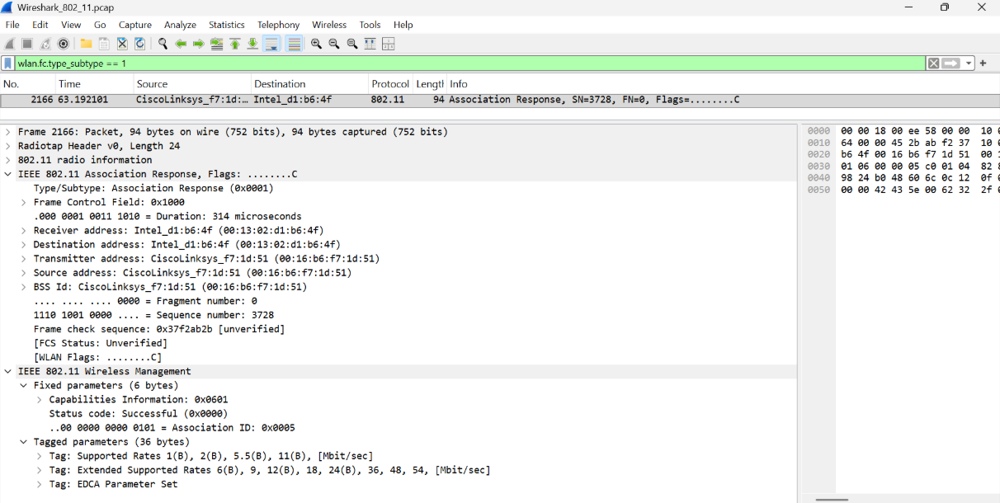
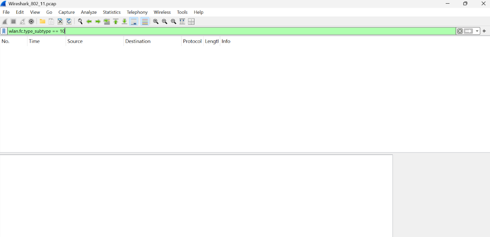

# MODUL 14 802.11 WIFI

IEEE 802.11 merupakan standar komunikasi jaringan nirkabel (WiFi) yang dikembangkan oleh IEEE. Standar ini mengatur proses pertukaran data melalui media udara pada lapisan fisik (Physical Layer) dan lapisan MAC (Media Access Control).

Dalam jaringan WiFi, Access Point (AP) berfungsi sebagai pusat komunikasi yang menghubungkan perangkat nirkabel ke jaringan. AP secara berkala mengirimkan beacon frame untuk mengumumkan keberadaan dan informasi jaringan kepada perangkat di sekitarnya.

Pada praktikum ini digunakan aplikasi Wireshark untuk menganalisis lalu lintas jaringan IEEE 802.11. Melalui Wireshark, dapat diamati berbagai jenis frame yang digunakan dalam komunikasi WiFi, seperti beacon frame, data frame, association, dan disassociation. Pengamatan tersebut membantu memahami proses kerja jaringan nirkabel secara lebih mendalam.

## Langkah-langkah Analisis

1. Mendownload "http://gaia.cs.umass.edu/wireshark-labs/wireshark-traces.zip"
2. Pilih & buka file Wireshark_802_11.pcap yang digunakan untuk menganalisis beacon frame, data frame, association, dan disassociation.
3. Menjalankan aplikasi Wireshark pada komputer.

## Analisis Beacon Frame

Analisis Beacon Frame dilakukan dengan memasukkan filter "wlan.fc.subtype == 8 && wlan.fc.type == 0" pada Wireshark. Filter tersebut digunakan untuk menampilkan frame manajemen (Management Frame) yang berjenis Beacon Frame. Setelah filter diterapkan, dipilih salah satu paket Beacon Frame untuk diamati lebih lanjut pada bagian 802.11 Radio Information dan IEEE 802.11 Wireless Management.

Berdasarkan hasil pengamatan, paket yang ditampilkan merupakan Beacon Frame yang dikirim oleh Access Point dengan SSID "30 Munroe St". Beacon Frame ini digunakan untuk mengumumkan keberadaan jaringan WiFi kepada perangkat yang berada dalam jangkauan sinyal.

Pada bagian 802.11 Radio Information, diperoleh informasi bahwa jaringan menggunakan standar fisik IEEE 802.11b (HR/DSSS) dengan kecepatan transmisi sebesar 1,0 Mb/s. Jaringan beroperasi pada Channel 6 dengan frekuensi 2437 MHz. Selain itu, terukur kekuatan sinyal sebesar -29 dBm, yang menunjukkan kualitas sinyal yang sangat baik karena nilainya mendekati 0 dBm.

Sementara itu, pada bagian Tagged Parameters ditemukan beberapa informasi penting mengenai jaringan, antara lain nama jaringan (SSID) "30 Munroe St", daftar Supported Rates yang didukung perangkat, informasi kanal yang digunakan yaitu Channel 6, serta berbagai parameter tambahan seperti Traffic Indication Map (TIM), Country Information, ERP Information, dan Extended Supported Rates.

Dari hasil analisis tersebut dapat disimpulkan bahwa Beacon Frame berfungsi sebagai media bagi Access Point untuk mengumumkan identitas dan karakteristik jaringan WiFi. Informasi yang terkandung di dalam Beacon Frame memungkinkan perangkat klien menemukan jaringan yang tersedia serta memperoleh parameter yang diperlukan sebelum melakukan proses koneksi.

## Analisis Data Transfer

Analisis transfer data dilakukan dengan menggunakan filter "tcp.port == 80" pada Wireshark. Filter tersebut digunakan untuk menampilkan paket yang berkomunikasi melalui port 80 yang merupakan port standar untuk layanan HTTP.

Berdasarkan hasil pengamatan, terlihat adanya proses komunikasi antara host 192.168.1.109 dan server 128.119.245.12 melalui protokol TCP pada port 80. Koneksi diawali dengan proses three-way handshake yang ditandai oleh paket SYN, SYN-ACK, dan ACK.

Setelah koneksi terbentuk, client mengirimkan permintaan HTTP GET /wireshark-labs/alice.txt untuk mengunduh file alice.txt dari server. Server kemudian mengirimkan data yang diminta kepada client. Selama proses transfer terlihat beberapa paket ACK, TCP Retransmission, dan TCP Dup ACK yang menunjukkan mekanisme TCP dalam memastikan data diterima dengan benar.

Dari hasil tersebut dapat disimpulkan bahwa proses transfer data pada jaringan WiFi dilakukan melalui komunikasi TCP dan HTTP, dimulai dari pembentukan koneksi, pengiriman permintaan file, hingga penerimaan data dari server.

## Analisis Proses Association & Disassociation

### Analisis Association Request

Analisis Association Request dilakukan dengan menggunakan filter wlan.fc.type_subtype == 0 pada Wireshark. Filter tersebut digunakan untuk menampilkan paket permintaan asosiasi yang dikirim oleh client kepada Access Point sebelum koneksi WiFi dibangun.

Berdasarkan hasil pengamatan, terlihat adanya paket Association Request yang dikirim dari client Intel_d1:b6:4f menuju Access Point CiscoLinksys_f5:ba:... menggunakan protokol IEEE 802.11. Pada bagian IEEE 802.11 Wireless Management, terdapat informasi Capabilities Information dan Listen Interval yang menunjukkan kemampuan perangkat client serta interval penerimaan paket dari Access Point.

Selain itu, pada bagian Tagged Parameters ditemukan informasi SSID Parameter Set dengan nama jaringan linksys_SES_24086, Supported Rates yang menunjukkan kecepatan transmisi yang didukung client, serta Vendor Specific WPA Information Element yang menandakan dukungan terhadap mekanisme keamanan WPA.

Berdasarkan hasil analisis, dapat disimpulkan bahwa Association Request merupakan tahap awal proses koneksi WiFi, di mana client mengirimkan informasi jaringan yang dituju, kemampuan perangkat, serta dukungan keamanan kepada Access Point sebelum koneksi dapat dibangun.

### Analisis Association Response

Analisis Association Response dilakukan dengan menggunakan filter wlan.fc.type_subtype == 1 pada Wireshark. Filter tersebut digunakan untuk menampilkan paket balasan dari Access Point terhadap permintaan asosiasi yang dikirim oleh client.

Berdasarkan hasil pengamatan, terlihat paket Association Response yang dikirim dari Access Point CiscoLinksys_f7:1d:51 menuju client Intel_d1:b6:4f menggunakan protokol IEEE 802.11. Pada bagian IEEE 802.11 Wireless Management, terdapat informasi Status Code: Successful (0x0000) yang menunjukkan bahwa permintaan asosiasi berhasil diterima oleh Access Point, serta Association ID (AID) sebesar 0x0005 yang diberikan kepada client.

Selain itu, pada bagian Tagged Parameters terdapat informasi Supported Rates dan Extended Supported Rates yang menunjukkan berbagai kecepatan transmisi yang didukung jaringan, mulai dari 1 Mbps hingga 54 Mbps. Terdapat pula EDCA Parameter Set yang digunakan untuk mendukung mekanisme Quality of Service (QoS) pada jaringan nirkabel.

Berdasarkan hasil analisis, dapat disimpulkan bahwa proses asosiasi berhasil dilakukan antara client dan Access Point. Setelah menerima Association Response dengan status berhasil, client secara resmi terhubung ke jaringan WiFi dan dapat mulai melakukan komunikasi data.

### Analisis Disassociation

Analisis Disassociation dilakukan dengan menggunakan filter wlan.fc.type_subtype == 10 pada Wireshark. Filter tersebut digunakan untuk menampilkan frame Disassociation, yaitu frame yang digunakan untuk mengakhiri hubungan antara client dan Access Point pada jaringan IEEE 802.11.

Berdasarkan hasil pengamatan, tidak ditemukan paket Disassociation pada file capture yang dianalisis. Setelah filter diterapkan, Wireshark tidak menampilkan frame yang sesuai dengan tipe tersebut. Hal ini menunjukkan bahwa selama proses perekaman lalu lintas jaringan, tidak terjadi atau tidak terekam proses pemutusan koneksi antara client dan Access Point.

Meskipun tidak ditemukan frame Disassociation, proses ini tetap merupakan bagian dari mekanisme manajemen pada jaringan WiFi. Frame Disassociation digunakan untuk menginformasikan bahwa hubungan antara perangkat client dan Access Point akan dihentikan sehingga kedua perangkat tidak lagi berada dalam status terasosiasi.