# Modul 4 DNS

# Nslookup
## Pertanyaan
1. Jalankan nslookup untuk mendapatkan alamat IP dari server web di Asia. Berapa alamat IP server tersebut? 

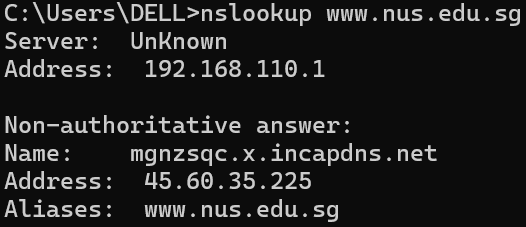

Alamat IP server web di Asia tersebut adalah 45.60.35.225

2. Jalankan nslookup agar dapat mengetahui server DNS otoritatif untuk universitas di Eropa. 

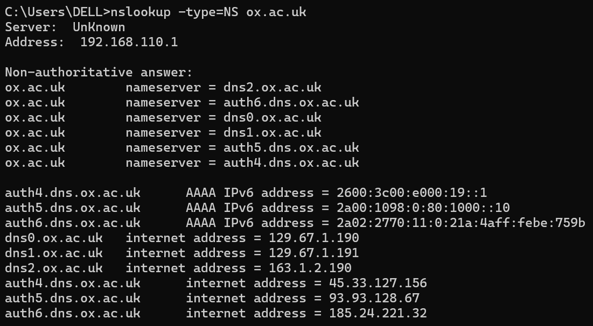

Server DNS otoritatif untuk universitas di Eropa (ox.ac.uk) adalah:
dns2.ox.ac.uk, auth6.dns.ox.ac.uk, dns0.ox.ac.uk, dns1.ox.ac.uk, auth5.dns.ox.ac.uk, auth4.dns.ox.ac.uk

3. Jalankan nslookup untuk mencari tahu informasi mengenai server email dari Yahoo! Mail melalui salah satuserver   yang didapatkan di pertanyaan nomor 2. Apa alamat IP-nya? 

Perintah pertama nslookup -type=MX yahoo.com 8.8.8.8 digunakan untuk mencari informasi mail server (MX record) dari domain yahoo.com dengan menggunakan DNS publik yaitu 8.8.8.8 (dns.google). Hasil yang diperoleh menunjukkan bahwa Yahoo Mail memiliki beberapa mail exchanger, yaitu mta7.am0.yahoodns.net, mta6.am0.yahoodns.net, dan mta5.am0.yahoodns.net dengan nilai prioritas (preference) yang sama, yaitu 1. Hal ini berarti ketiga server tersebut memiliki prioritas yang setara dalam menangani email masuk ke domain Yahoo.

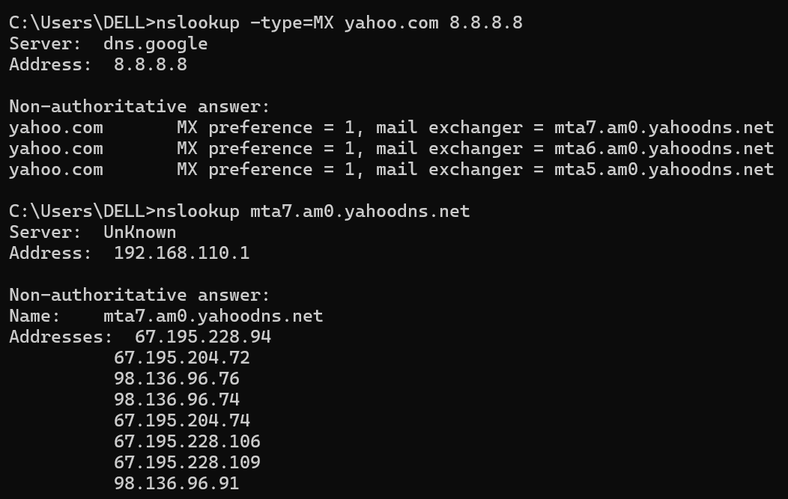

Selanjutnya, perintah kedua nslookup mta7.am0.yahoodns.net digunakan untuk mengetahui alamat IP dari salah satu mail server yang telah diperoleh sebelumnya. Hasilnya menunjukkan bahwa server tersebut memiliki beberapa alamat IP, seperti 67.195.228.94, 67.195.204.72, dan lainnya. Banyaknya alamat IP ini menunjukkan bahwa server menggunakan teknik load balancing atau distribusi beban agar layanan email tetap stabil dan cepat diakses.

# Tracing DNS dengan Wireshark 
## Langkah-langkah 
1. Membuka wireshark lalu start capture
2. Membuka browser dan mengakses: http://www.ietf.org
3. Menghentikan capture
4. Menambahkan filter untuk menampilkan DNS spesifik: dns && dns.qry.name contains "ietf"

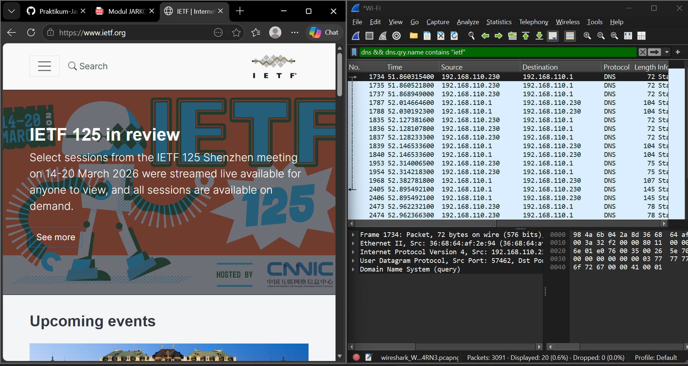 

## Pertanyaan
1. Cari pesan permintaan DNS dan balasannya. Apakah pesan tersebut dikirimkan melalui UDP atau TCP? 

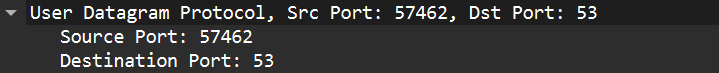 

Pesan DNS dikirim menggunakan protokol UDP karena DNS secara default menggunakan UDP pada port 53 untuk proses query yang lebih cepat dan ringan. 

2. Apa port tujuan pada pesan permintaan DNS? Apa port sumber pada pesan balasannya? 

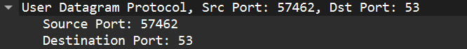 
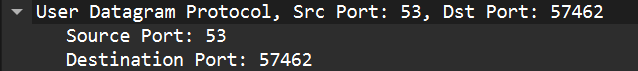 

Port tujuan pada pesan permintaan DNS adalah 53, sedangkan port sumber pada pesan balasannya adalah 53.

3. Pada pesan permintaan DNS, apa alamat IP tujuannya? Apa alamat IP server DNS lokal anda 
(gunakan ipconfig untuk mencari tahu)? Apakah kedua alamat IP tersebut sama? 

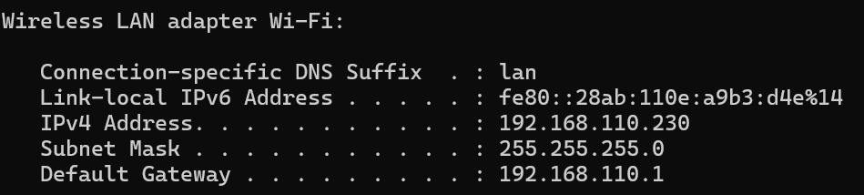 

Alamat IP tujuan pada pesan permintaan DNS adalah 192.168.110.1. Alamat IP server DNS lokal berdasarkan ipconfig juga 192.168.110.1. Kedua alamat IP tersebut sama.

4. Periksa pesan permintaan DNS. Apa “jenis” atau ”type” dari pesan tersebut? Apakah pesan 
permintaan tersebut mengandung ”jawaban” atau ”answers”? 

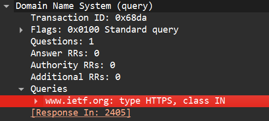 

Jenis (type) dari pesan permintaan DNS adalah HTTPS, yang digunakan untuk memperoleh informasi layanan HTTPS dari domain. Pesan permintaan tersebut tidak mengandung jawaban (answers) karena hanya berupa permintaan.

5. Periksa pesan balasan DNS. Berapa banyak ”jawaban” atau ”answers” yang terdapat di 
dalamnya? Apa saja isi yang terkandung dalam setiap jawaban tersebut? 

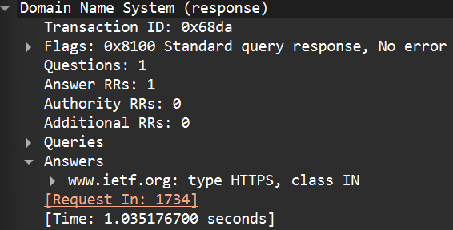 

Terdapat 1 jawaban (answer) pada pesan balasan DNS. Jawaban tersebut berisi informasi mengenai domain www.ietf.org
, yaitu data layanan HTTPS yang terkait dengan domain tersebut.

6. Perhatikan paket TCP SYN yang selanjutnya dikirimkan oleh host Anda. Apakah alamat IP 
pada paket tersebut sesuai dengan alamat IP yang tertera pada pesan balasan DNS? 

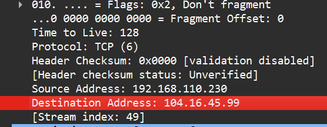 

Ya, alamat IP pada paket TCP SYN sesuai dengan alamat IP yang tertera pada pesan balasan DNS.

7. Halaman web yang sebelumnya anda akses (http://www.ietf.org) memuat beberapa 
gambar. Apakah host Anda perlu mengirimkan pesan permintaan DNS baru setiap kali ingin 
mengakses suatu gambar?

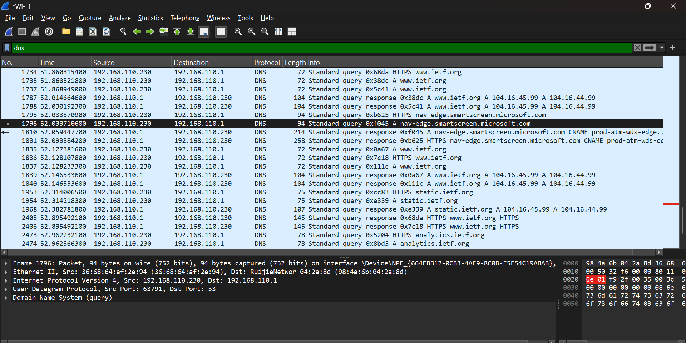 

Tidak, host tidak perlu mengirimkan permintaan DNS baru setiap kali mengakses gambar. Hal ini karena hasil DNS disimpan dalam cache, sehingga permintaan berikutnya dapat langsung menggunakan alamat IP yang sudah diperoleh sebelumnya.

# Tracing DNS dengan nslookup
## Langkah-langkah
1. Membuka wireshark lalu start capture
2. Membuka Command Prompt. 
3. Menjalankan perintah: nslookup www.mit.edu 192.168.1.1
4. Menambahkan filter untuk mempermudah pencarian: dns && dns.qry.name contains "mit"

## Pertanyaan
1. Apa port tujuan pada pesan permintaan DNS? Apa port sumber pada pesan balasan DNS? 

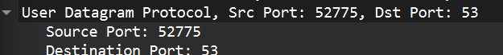 
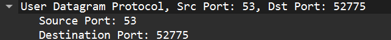 

Port tujuan pada pesan permintaan DNS adalah 53, sedangkan port sumber pada pesan balasannya adalah 53.

2. Ke alamat IP manakah pesan permintaan DNS dikirimkan? Apakah alamat IP tersebut 
merupakan default alamat IP server DNS lokal Anda? 

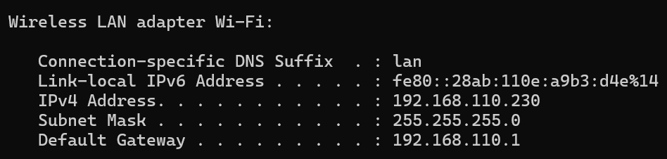 

Pesan permintaan DNS dikirim ke alamat IP 192.168.1.1. Alamat IP tersebut bukan merupakan alamat IP server DNS lokal, karena berbeda dengan default gateway yang digunakan, yaitu 192.168.110.1.

3. Periksa pesan permintaan DNS. Apa ”jenis” atau ”type” dari pesan tersebut? Apakah pesan 
tersebut mengandung ”jawaban” atau ”answers”? 

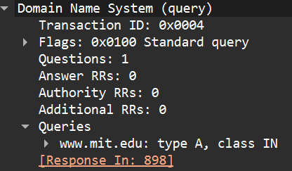 

Jenis (type) dari pesan permintaan DNS adalah A, yaitu untuk mencari alamat IP (IPv4). Pesan tersebut tidak mengandung jawaban (answers).

4. Periksa pesan balasan DNS. Berapa banyak ”jawaban” atau “answers” yang terdapat di 
dalamnya. Apa saja isi yang terkandung dalam setiap jawaban tersebut?

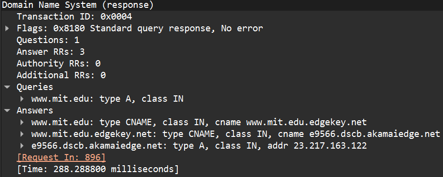 

Pesan balasan DNS memiliki beberapa jawaban (answers). Setiap jawaban berisi informasi mengenai domain www.mit.edu
, seperti alias (CNAME) ke domain lain serta alamat IP (A record) yang digunakan untuk mengakses server tersebut.

# Nslookup Type NS
## Langkah-langkah
1. Membuka Wireshark dan memilih interface jaringan aktif (Wi-Fi).
2. Menjalankan proses capture paket (Start).
3. Membuka Command Prompt.
4. Menjalankan perintah: nslookup -type=NS mit.edu 192.168.1.1
5. Kembali ke Wireshark dan menghentikan proses capture (Stop).
6. Memasukkan filter: dns
7. Menambahkan filter untuk mempermudah pencarian:Menambahkan filter untuk mempermudah pencarian: dns && dns.qry.name contains "mit"

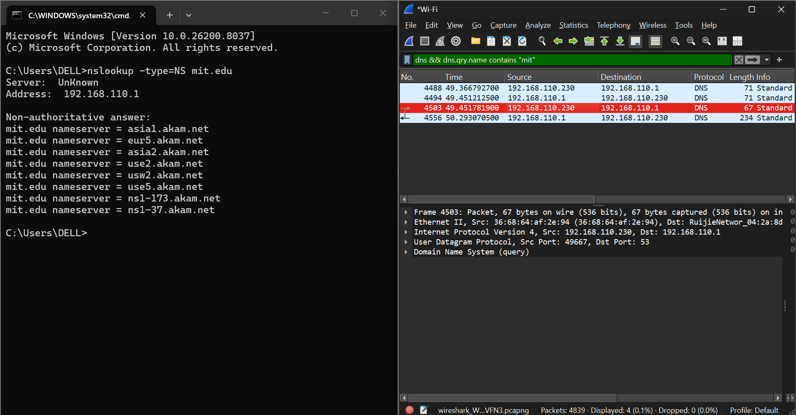 

## Pertanyaan
1. Ke alamat IP manakah pesan permintaan DNS dikirimkan? Apakah alamat IP tersebut merupakan default alamat IP server DNS lokal Anda? 

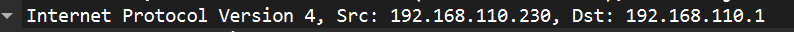
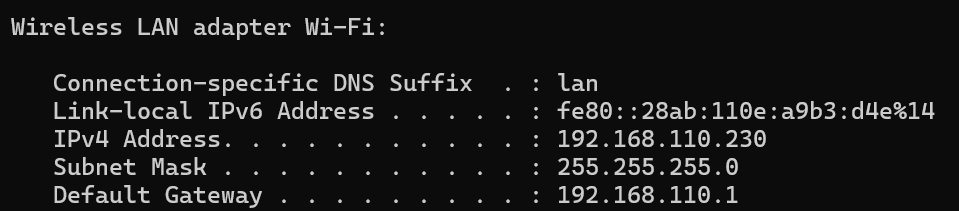

Pesan permintaan DNS dikirim ke alamat IP 192.168.110.1. Alamat IP tersebut merupakan alamat IP server DNS lokal, sehingga keduanya sama.

2. Periksa pesan permintaan DNS. Apa ”jenis” atau ”type” dari pesan tersebut? Apakah pesan 
tersebut mengandung ”jawaban” atau ”answers”? 

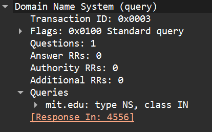

Jenis (type) dari pesan permintaan DNS adalah NS, yaitu untuk mencari name server dari domain mit.edu. Pesan tersebut tidak mengandung jawaban (answers).

3. Periksa pesan balasan DNS. Apa nama server MIT yang diberikan oleh pesan balasan? 
Apakah pesan balasan ini juga memberikan alamat IP untuk server MIT tersebut?

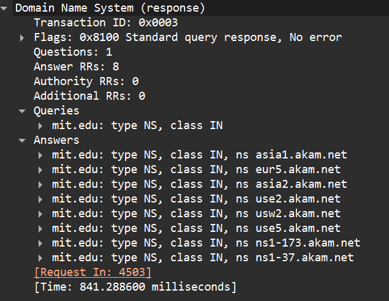

Pesan balasan DNS memberikan beberapa nama server (name server) untuk domain mit.edu, seperti use2.akam.net, asia1.akam.net, dan lainnya. Pesan balasan ini tidak secara langsung memberikan alamat IP dari server tersebut.

# nslookup www.aiit.or.kr bitsy.mit.edu
## Pertanyaan
1. Ke alamat IP manakah pesan permintaan DNS dikirimkan? Apakah alamat IP tersebut 
merupakan default alamat IP server DNS lokal Anda? 

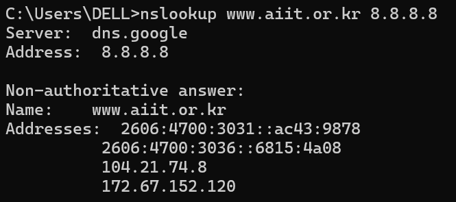

Pesan permintaan DNS dikirim ke alamat IP 8.8.8.8. Alamat IP tersebut bukan merupakan alamat IP server DNS lokal, karena menggunakan server DNS publik (Google DNS).

2. Periksa pesan permintaan DNS. Apa ”jenis” atau ”type” dari pesan tersebut? Apakah pesan 
tersebut mengandung ”jawaban” atau ”answers”? 

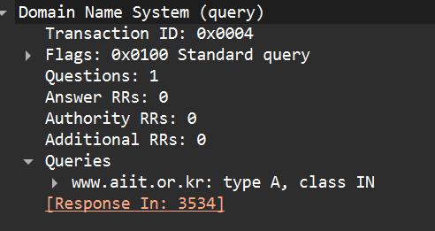

Type dari pesan permintaan DNS adalah A (Host Address). Pesan tersebut tidak mengandung jawaban (answers), yang ditunjukkan dengan nilai Answer RRs: 0, karena merupakan pesan permintaan dari client ke server DNS.

3. Periksa pesan balasan DNS. Berapa banyak ”jawaban” atau “answers” yang terdapat di 
dalamnya. Apa saja isi yang terkandung dalam setiap jawaban tersebut?

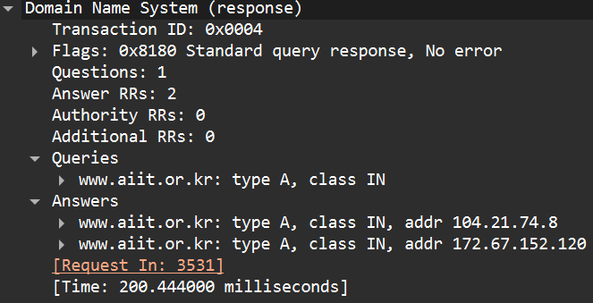

Pada pesan balasan DNS terdapat 2 answers, yang ditunjukkan oleh nilai Answer RRs: 2. Setiap answer berisi alamat IP hasil resolusi dari domain www.aiit.or.kr. Adapun isi dari masing-masing jawaban adalah:

www.aiit.or.kr → Address: 104.21.74.8 www.aiit.or.kr → Address: 172.67.152.120