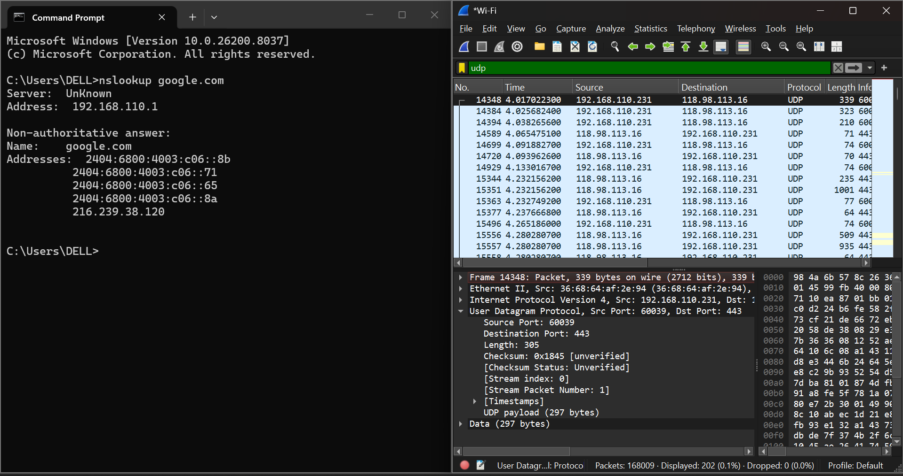
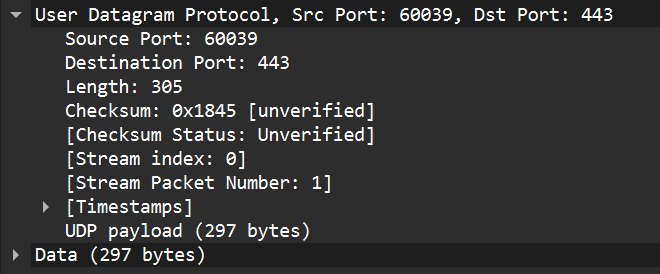
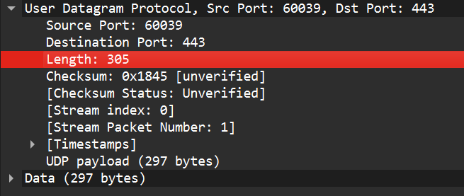
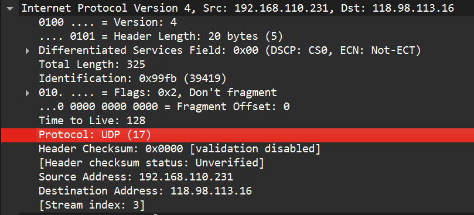
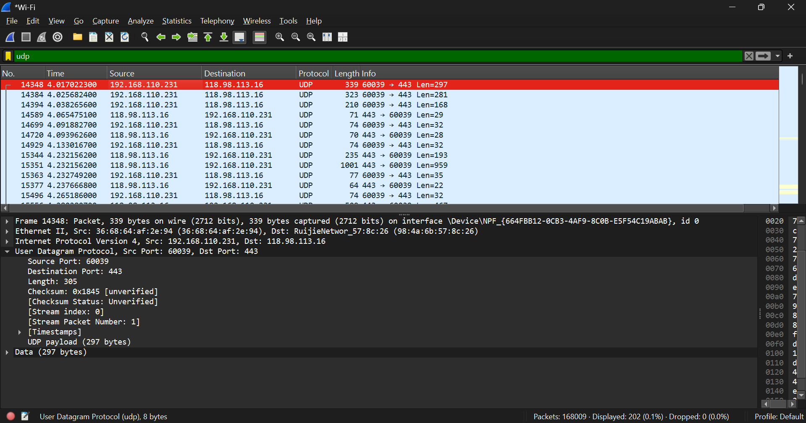
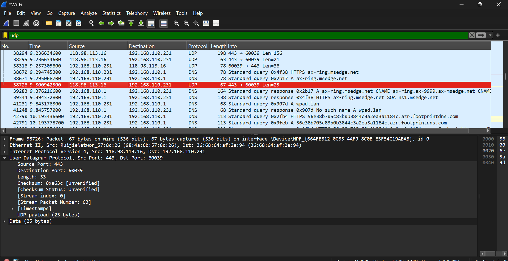

# Modul 5 
## Langkah-langkah : UDP

1. Membuka aplikasi Wireshark dan memilih interface jaringan aktif (Wi-Fi).
2. Menjalankan proses capture paket dengan menekan tombol Start.
3. Menghasilkan trafik UDP dengan menjalankan perintah pada Command Prompt: nslookup google.com
4. Kembali ke Wireshark dan menghentikan proses capture dengan menekan tombol Stop.
5. Memasukkan filter untuk menampilkan paket UDP: udp
6. Memilih salah satu paket UDP dari hasil capture.
Memperluas bagian User Datagram Protocol pada detail paket untuk melihat field header UDP.

Pertanyaan
1). Pilih satu paket UDP yang terdapat pada trace Anda. Dari paket tersebut, berapa banyak 
“field” yang terdapat pada header UDP? Sebutkan nama-nama field yang Anda temukan! 

Berdasarkan hasil pengamatan pada Wireshark, header UDP terdiri dari 4 field, yaitu:
Source Port
Destination Port
Length
Checksum

2). Perhatikan informasi “content field” pada paket yang Anda pilih di pertanyaan 1. Berapa 
panjang (dalam satuan byte) masing-masing “field” yang terdapat pada header UDP? 

Header UDP memiliki panjang total sebesar 8 byte, yang terdiri dari beberapa field dengan ukuran tetap.
Setiap field pada header UDP memiliki panjang 16 bit (2 byte), karena ukuran tersebut cukup untuk merepresentasikan nilai port, panjang data, dan checksum dalam komunikasi jaringan.
Adapun panjang masing-masing field pada header UDP adalah:
Source Port: 2 byte
Destination Port: 2 byte
Length: 2 byte
Checksum: 2 byte

3). Nilai yang tertera pada ”Length” menyatakan nilai apa? Verfikasi jawaban Anda melalui 
paket UDP pada trace. 

Nilai pada field Length menyatakan panjang total segmen UDP, yaitu gabungan antara header dan data (payload).
Berdasarkan hasil pengamatan pada Wireshark, nilai Length adalah 305 byte.
Karena panjang header UDP adalah 8 byte, maka panjang data (payload) adalah 297 byte.
Hal ini membuktikan bahwa nilai Length merupakan jumlah dari header dan data.

4). Berapa jumlah maksimum byte yang dapat disertakan dalam payload UDP? 

Jumlah maksimum byte yang dapat disertakan dalam payload UDP adalah 65527 byte.
Hal ini diperoleh dari ukuran maksimum field Length sebesar 65535 byte, dikurangi dengan ukuran header UDP sebesar 8 byte.
Dengan demikian, payload maksimum = 65535 − 8 = 65527 byte.

5). Berapa nomor port terbesar yang dapat menjadi port sumber?

Nomor port terbesar yang dapat menjadi port sumber adalah 65535.
Hal ini karena field Source Port pada header UDP memiliki panjang 16 bit (2 byte), sehingga nilai maksimum yang dapat direpresentasikan adalah 2^16 − 1 = 65535.

6). Berapa nomor protokol untuk UDP? 

Nomor protokol untuk UDP adalah 17 dalam notasi desimal, dan 0x11 dalam notasi heksadesimal.
Hal ini dapat dilihat pada field Protocol di bagian Internet Protocol (IP) pada paket yang diamati di Wireshark.

7). Periksa pasangan paket UDP di mana host Anda mengirimkan paket UDP pertama dan paket 
UDP kedua merupakan balasan dari paket UDP yang pertama. 

Pada pasangan paket UDP, nomor port pada paket balasan merupakan kebalikan dari paket permintaan.
Pada paket pertama, Source Port adalah 60039 dan Destination Port adalah 443.
Pada paket kedua (balasan), Source Port menjadi 443 dan Destination Port menjadi 60039.
Hal ini menunjukkan bahwa port asal dan tujuan saling bertukar pada proses komunikasi antara client dan server.