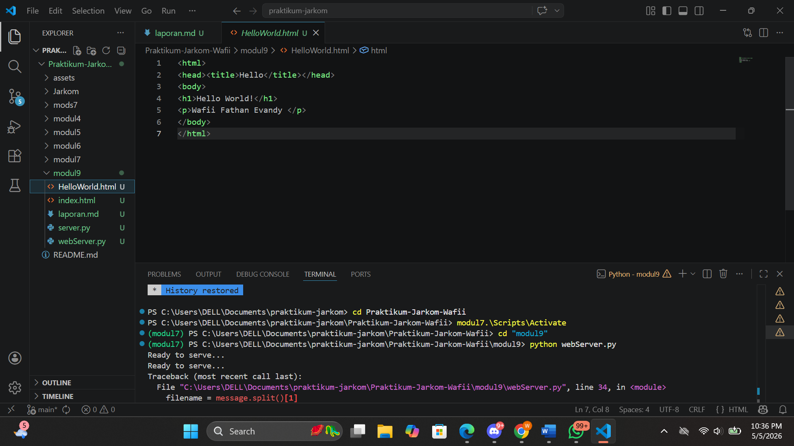
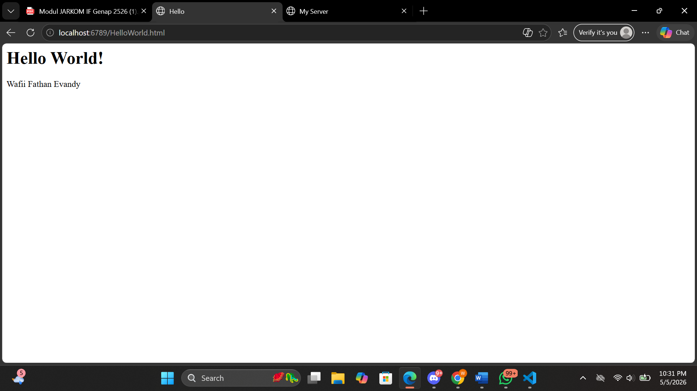
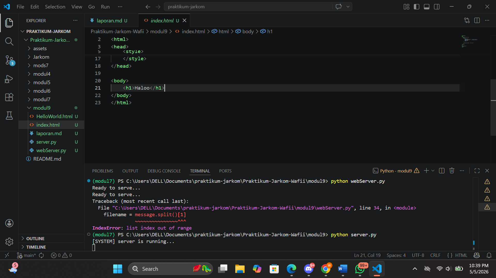
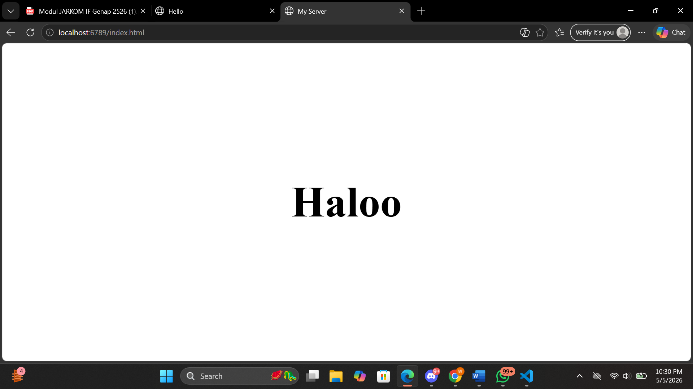

# Modul 9

# Web Server

Pada percobaan ini dilakukan pelengkapan kode skeleton web server menggunakan Python. Program menggunakan socket TCP dengan port 6789. Server menunggu koneksi client, menerima request HTTP, membaca file HTML yang diminta, lalu mengirimkan isi file tersebut ke browser. Jika file tidak ditemukan, server memberikan respon 404 Not Found.

## Langkah-Langkah membuat webServer

1. Buat kode program seperti saya yg sudah tersedia di dalam webServer.py

2. Jalankan kode Programnya. Dan tampilannya akan muncul seperti ini

3. Lalu buka di browser ketik sesuai judul html kalian (http://localhost:6789/HelloWorld.html) lalu tampilannya akan muncul pada gambar dibawah ini

# Latihan

# Server

## Langkah-Langkah

1. Buat file server.py seperti yg tertera dalam file saya

2. Lalu jalankan kode programnya. Dan akan mucul seperti gambar dibawah ini

3. Lalu buka di browser ketik sesuai judul html kalian (http://localhost:6789/index.html) lalu tampilannya akan muncul pada gambar dibawah ini

